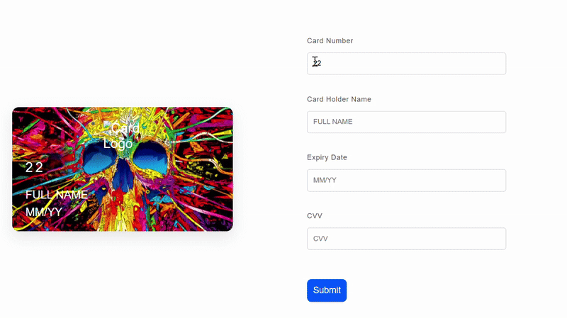

# 💳 Interactive Card Payment Form

This project is a simple **interactive credit/debit card form** built with **HTML, CSS, and JavaScript**.  
It provides a real-time preview of card details (number, holder name, expiry date, and CVV) as the user types them into the form.  
This project is made from vide coding and differnt llm models that help get my idea to life.

---

## 📂 Project Structure
-├── **card cool.html** # Light-themed interactive card form.
-├── **payment interface.html** # Dark-themed interactive payment form.
-├── **cardback.png** # Card background image (used in previews).
-├── **payment design 2.html** #cardpayment design extra.
-├── **payment design 3.html** # card payment desing extra.
---

## ✨ Features

- 🖊️ **Live Preview** – Card number, name, expiry date, and CVV update instantly as you type.  
- 🎨 **Modern UI** – Two versions available:  
  - `card cool.html` → Light version with local assets  
  - `payment interface.html` → Dark version with hosted images  
- 📱 **Responsive Design** – Works on desktop and mobile  
- ⚡ **Lightweight** – Pure HTML, CSS, and JavaScript  

---

## 🖼️ Videos

### Light Version  

  
 

---

## ⚙️ Customization  

- Replace `logo-placeholder.png` or hosted URLs with your own **card logos**.  
- Update `cardback.png` or background images for a different design.  
- Modify `handleSubmit()` in JavaScript to integrate with a **real payment gateway**.  

---

## 📌 Notes  

- This project is only a **UI mockup**.  
- It does **not** process real payments.  
- For production use, integrate with secure payment APIs such as **Stripe, Razorpay, or PayPal**.  

   
